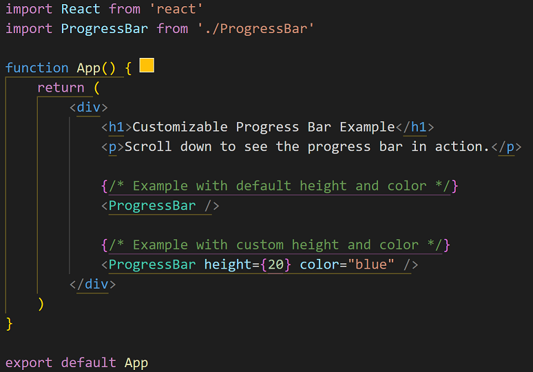
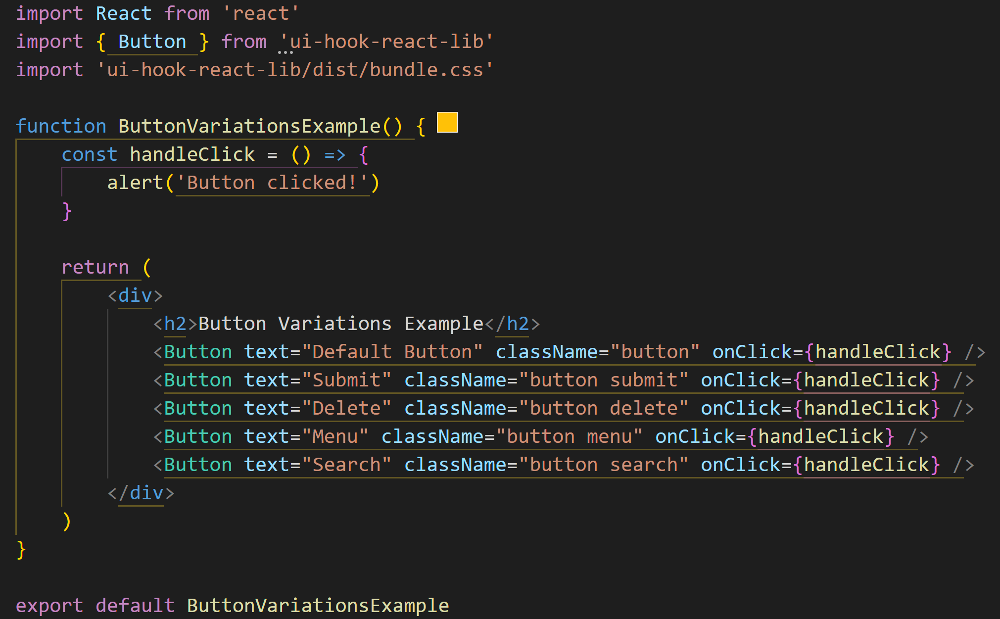
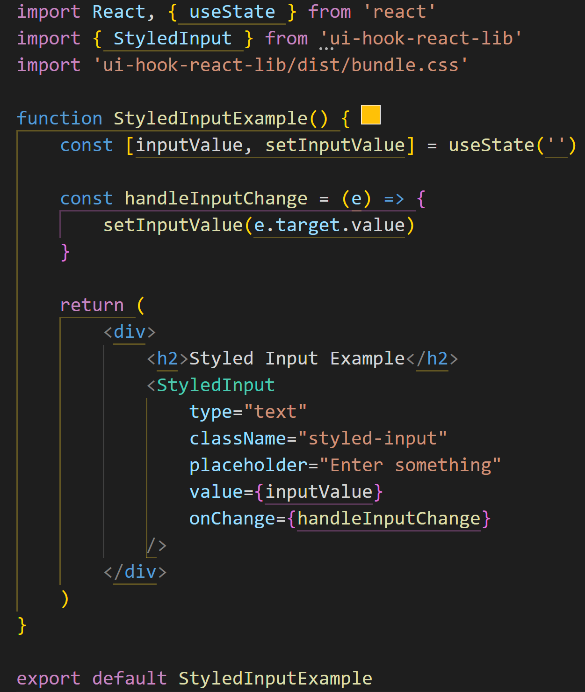

<h1>react-ui-hook-lib</h1>
A collection of reusable React UI components and hooks.

<h2>Installation:</h2>
npm i react-ui-hook-lib

<h3>Peer Dependencies:</h3>
react 
react-dom

<h4>Features:</h4>
<h5>UI</h5>
<ul>
<li>Progress Bar</li>

<li>Buttons (Default, Menu, Search, Submit, Delete)</li>

<li>Styled Input</li>
  
<li>Image Gallery</li>
  
</ul>

<h5>Hooks</h5>
<ul>
<li>
useLocalStorage
</li>
</ul>

