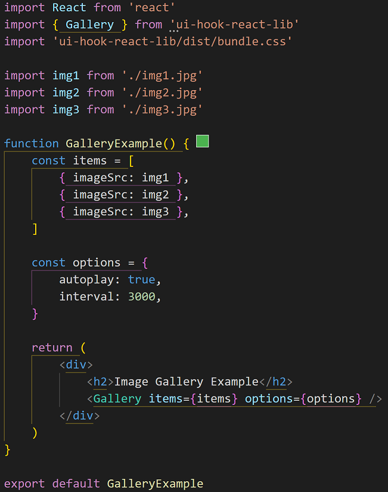

<h1>react-ui-hook-lib</h1>
A collection of reusable React UI components and hooks.
  <a href="https://test-ui-components.vercel.app">Live Demo</a> 
<h2>Installation:</h2>

npm install react-ui-hook-lib

import { Gallery, Button, ProgressBar, useLocalStorage, StyledInput } from 'ui-hook-react-lib'

import 'ui-hook-react-lib/dist/bundle.css'

<h3>Peer Dependencies:</h3>
react, react-dom
  install by running: 
npm install react react-dom

<h4>Features:</h4>
<h5>UI</h5>
<ul>
<li>Progress Bar</li>

<li>Buttons (Default, Menu, Search, Submit, Delete)</li>

<li>Styled Input</li>

<li>Image Gallery</li>
  
</ul>

<h5>Hooks</h5>
<ul>
<li>useLocalStorage</li>

</ul>

